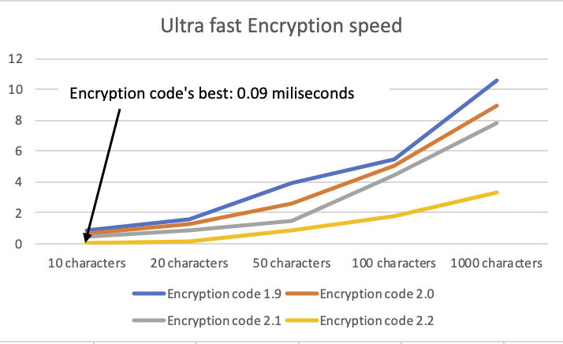

# Encryption-code

## Data security: Redefined.

### This is Encryption code. The world's most innovative text Encryption service

- **Top security features**
    - Multiple Encryption algorithms
    - Password Protected Encryption
    - 4 try password lockout
    - Internal Encrypted memory (_New!_)
    - Back up data to email (_Coming soon!_)

- Encryption code Stats

Through the use of Innovative and Efficient algorithms, along with faster processing, Encryption code is faster than ever.

- **Top Features: Encryption code 2.2**
    - Encryption code accounts: Encryption code users can now make local accounts with Encryption code, so that they can keep their data safe and access it from anywhere (coming soon!)

    - Brand new user interface: Encryption code 2.2 has a brand-new user interface, with encryption/decryption detection, smoother animations, and spaced content.

    - Internal account memory: Encryption code accounts have up to 100 MB of free text storage in text files. the text will be encrypted and stored in the file.

    - Up to 2X faster user experience: With much improvement in processing speed and faster animations, Encryption code now offers up to 2X faster user experience.

    - Return to the Main menu any time: At any point when Encryption code is running, the user can press control c to return to the main menu.

    - 10X faster Encryption: Encryption code's text processor now scans and uses faster algorithms to deliver a 10x faster* Encryption experience. *Compared to Encryption code 1.1.9

    - Encrypt and Decrypt from Main menu: Encryption code 2.2 allows encryption and decryption directly form the main menu, saving time.

    - Inspiring animations: Encryption code's animations are smooth and cool, from the start up animation, to main menu and encryption animations.

* NOTE: To protect the security of Encryption code, all current Encryption codes have been obfuscated.
